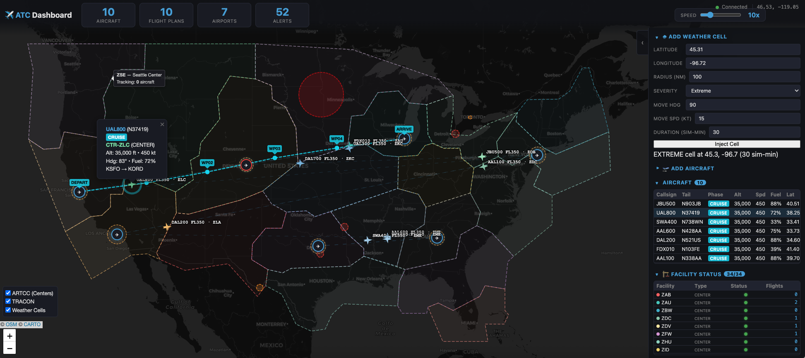

# National Air-Traffic Control: RTI Connext DDS Blueprint

A national air-traffic control simulation built with
[RTI Connext DDS](https://www.rti.com/products/connext-professional). It shows how DDS
publish-subscribe, DDS request-reply, content filtering, QoS, and discovery
solve a large, real-time distributed-systems problem end to end. Aircraft,
towers, TRACONs, en-route centers, and shared services each run as
independent applications that share one data space. None of them opens a
connection to another or knows where another runs.

## Scenario

A simulated national air-traffic control system spanning multiple airports. 



Aircraft fly between airports while control towers, TRACON facilities, and en-route centers coordinate traffic flow, issue instructions, and manage handoffs — just like the real national airspace system.

### Components

| Component | Role | Instances |
|---|---|---|
| **Airplane** | Position reporting, flight plan filing, gate requests | 1 per aircraft |
| **Airport** | Weather reports, runway status, gate assignment | 1 per airport |
| **Control Tower** | Terminal-area clearances, runway management | 1 per airport |
| **TRACON** | Arrival sequencing, departure handoffs | 1 per TRACON |
| **En-Route Center** | Separation monitoring, weather rerouting, sector handoffs | 1 per center |
| **Flight Plan Service** | Central plan validation and publishing | 1 |
| **Weather Service** | Convective cell generation for en-route hazards | 1 |
| **Dashboard** | Web-based real-time map and monitoring | 1 |

### Data Flows

```
┌──────────────┐    handoffs   ┌──────────────┐
│ En-Route     │◄─────────────►│ En-Route     │
│ Center A     │               │ Center B     │
└──────┬───────┘               └───────┬──────┘
       │                               │
  ┌────▼─────┐                   ┌─────▼────┐
  │ TRACON 1 │                   │ TRACON 2 │
  └────┬─────┘                   └─────┬────┘
       │                               │
  ┌────▼──────┐                  ┌─────▼─────┐
  │ Tower 1   │                  │ Tower 2   │
  │(Airport 1)│                  │(Airport 2)│
  └────┬────-─┘                  └─────┬──-──┘
       │                               │
  ✈ ✈ ✈ ✈                         ✈ ✈ ✈ ✈
 Aircraft at                      Aircraft at
 Airport 1                        Airport 2

       ✈  ✈  ✈  ✈  ✈  (en-route aircraft)

┌─────────────────────┐   ┌───────────────────┐
│ Flight Plan Service │   │ Weather Service   │
└─────────────────-───┘   └───────────────────┘

┌─────────────────────┐
│ Dashboard (observer)│
└─────────────────────┘
```

### Interaction Patterns

- **Publish/Subscribe:** Position reports, weather, runway status, alerts, tracking state
- **Command/Response:** Controller instructions → pilot acknowledgments, handoff initiation → acceptance
- **Request/Reply:** Flight plan filing, gate assignment

## Why Connext DDS for Air-Traffic Control

Writing a demo like this is straightforward, especially with AI assistance.
What matters is how the **running system** behaves at realistic scale, under
failures, and as it grows. The US national airspace has roughly 5,000
aircraft airborne at once, about 20 en-route centers, about 180 TRACONs, and
about 500 towered airports. The examples below come straight from the code in
this repo.

### Example 1: Publishing position updates (pub/sub)

An aircraft publishes its position at 5 Hz. Centers, TRACONs, towers, and the
dashboard all need it.

The aircraft calls `write()` once on the `AircraftPosition` topic, and the
middleware delivers the sample to every matched reader. The aircraft
application doesn't know how many consumers exist or where they are. Each
facility's reader has a content filter that Connext evaluates at the *writer*:
a center filters by bounding box and altitude band, and a tower filters by
airport. Data that matches no filter never crosses the network.

Adding a new consumer, such as a military coordinator that watches
`position.altitude_feet > 40000`, means creating one new reader with one new filter. No
existing application changes.

### Example 2: Handing off an aircraft between centers (command)

Center ZNY sees an aircraft leaving its airspace and needs to transfer
control to Center ZLA.

ZNY writes a `Handoff` sample with `to_controller_id = 'CTR-ZLA'` and
`status = INITIATED`. ZLA's reader has a content filter for handoffs to or
from its own controller ID, so it receives the sample, and it answers with
an `ACCEPTED` sample on the same topic. ZNY needs only ZLA's *logical
controller ID*, not its network address, and neither center opens a
connection to the other. The controller of record is published on
`AircraftTracking`, whose QoS is `SHARED_OWNERSHIP` + `BY_SOURCE_TIMESTAMP`,
so every observer, including the dashboard and any supervisory tool,
converges on the same answer without extra code.

### Example 3: Changing simulation speed at runtime (distributed control state)

The dashboard lets an operator change the simulation speed while everything
is running. Every aircraft and facility must stay on the same simulated
clock, including applications that start later.

The dashboard sets a `sim_clock` property on its DomainParticipant with
propagation enabled: a reference point (real time and simulated time) plus
the new speed. Connext distributes the property through participant
discovery, which it already runs, and the other applications read it from
their built-in participant discovery reader. That needs no new topic,
service, port, or connection. Late joiners get the current setting as part
of discovery and compute the same simulated time immediately (see
[docs/SCENARIO.md](docs/SCENARIO.md)).

### At national scale

Take 5,000 aircraft publishing position at 5 Hz (~200 bytes per sample),
with 20 en-route centers consuming:

| | Connext DDS |
|---|---|
| **Application `write()` calls** | 5,000 × 5 = **25,000/s**: one `write()` per aircraft per update, however many readers there are |
| **Network packets (WAN, no multicast)** | Each aircraft matches about 2.5 centers' bounding-box filters (its own plus overlapping neighbors), so 5,000 × 5 × 2.5 ≈ **62,500/s** |
| **Readers per center** | **1** `AircraftPosition` DataReader, whether there are 10 aircraft or 5,000 |
| **Adding TRACONs, towers, and the dashboard** | The `write()` count stays at 25,000/s. Packets grow only by the readers whose filters actually match |

Thread and connection counts depend on the number of applications, not on
how many producers each consumer hears from.

### When connectivity is temporarily lost

**Scenario:** a 30-second network partition between Center ZNY (New York)
and Center ZLA (Los Angeles) while aircraft are being handed off between
them.

- **Reliable data (handoffs, instructions):** the writer keeps
  unacknowledged samples queued. When connectivity returns, the reliability
  protocol retransmits them automatically, and the application code isn't
  involved.
- **Who controls the aircraft?** If both centers wrote tracking updates
  during the partition, `BY_SOURCE_TIMESTAMP` ordering on `AircraftTracking`
  makes every reader converge on the newest one after reconnection.
- **Position data:** best-effort samples sent during the outage are lost
  by design, because stale positions have no value. The next one arrives
  within 200 ms of reconnection.

### When a controller facility restarts

- **Detection:** `FacilityStatus` uses a 5-second manual-by-topic liveliness
  lease. Every subscriber is notified through a middleware callback when it
  expires.
- **Recovery:** the restarted facility rejoins the domain and is discovered
  automatically. Transient-local data (flight plans, tracking state, runway
  status) arrives right away from its peers' caches, so the facility starts
  with the current state of the system instead of empty caches.

### Adding a new component

**Scenario:** add a military airspace coordinator that monitors every aircraft
above 40,000 ft.

- **Data access:** a reader on `AircraftPosition` with the content filter
  `position.altitude_feet > 40000`. Connext evaluates the filter at each publisher.
- **Discovery:** join the domain with the right partitions, and every
  relevant participant is discovered automatically.
- **Impact on the existing system:** none. Existing applications don't know
  the coordinator exists.

### Real-time guarantees as configuration

Connext enforces these QoS policies in the middleware. They behave the same
in any language, and changing them means editing
[`air_traffic_qos.xml`](air_traffic_qos.xml), not code:

| Requirement | Connext DDS mechanism |
|---|---|
| **"Alert me if position data stops arriving"** | Deadline QoS on `AircraftPosition` (300 ms writer / 500 ms reader); the middleware fires a violation callback |
| **"Tell me if a facility goes offline"** | Liveliness lease on `FacilityStatus` (5 s); detection is automatic |
| **"All observers agree on who controls the aircraft"** | `SHARED_OWNERSHIP` + `BY_SOURCE_TIMESTAMP` on `AircraftTracking` |
| **"Don't deliver stale positions"** | Lifespan QoS (1 s) on `AircraftPosition`; the middleware discards old samples |
| **"New subscribers see current state immediately"** | Transient-local durability on state, command, and handoff topics |
| **"Only send data a subscriber needs"** | Content-filtered topics, evaluated at the writer |

## Prerequisites

### Dashboard basemap

The dashboard uses [CARTO basemaps](https://carto.com/basemaps/),
which require a CARTO-issued API key. Keys are free within CARTO's fair-use
limit of five million tile requests per calendar month. Request a key at
[carto.com/basemaps/apikey](https://carto.com/basemaps/apikey/) and authorize
`localhost` when prompted.

For persistent local configuration, copy the provided template and edit it:

```bash
cp .env.example .env.local
```

Set `CARTO_BASEMAP_API_KEY` and `RTI_LICENSE_FILE` in `.env.local`. Git
ignores this file. `setup.sourceme` and the demo launcher load it
automatically, so the values persist across terminal sessions without being
committed. If `.env.local` is absent, you can still export the values
directly in the shell.

Do not commit your key. Every user or deployment must use its own key and
comply with the [CARTO Basemaps Terms](https://carto.com/legal/basemap-terms/),
including usage restrictions, the monthly fair-use limit, and attribution.
Although the key is kept out of this repository, it is necessarily visible to
dashboard users in browser tile requests. Configure domain restrictions and
usage limits with CARTO, and monitor the key for abuse.

### Connext DDS

- **RTI Connext DDS license file.** A free Connext license file
  (`rti_license.dat`). Download it from
  [evaluation.rti.com/workspaces/license](https://evaluation.rti.com/workspaces/license)
  after logging in with your RTI account. If you don't have an account, you
  can create one on the same page; it's also free. Set `RTI_LICENSE_FILE` in
  `.env.local` to the path of your license file before running the demo.
- Python 3.10+

The demo does not need a Connext installation: the setup script installs
the Connext Python API (`rti.connext`) from PyPI, and the generated type
support is checked in.

#### Optional: Full Connext Installation

Install RTI Connext DDS 7.7 by following the instructions at
[evaluation.rti.com](https://evaluation.rti.com) to get two more tools:

- **`rtiddsgen`**, to regenerate the Python type support after changing
  `air_traffic_types.idl` (see the [Python README](python/README.md)).
- **RTI Collector Service**, which `scripts/collector_start.sh` runs so you
  can inspect the live system remotely with RTI Admin Console.

## Quick Start

```bash
# Clone the repository
git clone https://github.com/rticommunity/rticonnextdds-blueprint-air-traffic.git
cd rticonnextdds-blueprint-air-traffic

# Set up virtual environment and install dependencies
source setup.sourceme

# Run the demo (defaults to all apps, 60 min)
./scripts/demo_start.sh
```

Open http://localhost:8050 for the real-time dashboard.

All applications join DDS domain `0` with the domain tag `airtraffic-USA`, which
keeps them isolated from other Connext applications on the network. To run a
second, independent demo on the same network, set a different `DOMAIN_TAG`
(or `DOMAIN_ID`) in `.env.local`. The launchers and `docker/run.sh` pass both
through.

The scenario file controls the simulated start time, each aircraft's
schedule, forecast and random weather, and an optional `seed` that makes runs
repeat exactly. See [docs/SCENARIO.md](docs/SCENARIO.md).

To check that everything works end to end, run the smoke test. It starts the
full demo at a higher simulation speed with a scripted storm on the
KJFK–KLAX route, waits for flight plan filing, a handoff, a gate assignment,
and a weather deviation, checks the dashboard, and stops the demo:

```bash
./scripts/smoke_test.sh
```

### Docker

```bash
# Build the image (from repo root)
docker build -f docker/Dockerfile -t atc-demo .

# Run the full demo (stages and mounts RTI_LICENSE_FILE from .env.local)
./docker/run.sh

# Run only the dashboard
./docker/run.sh dashboard
```

The host-side launcher reads `.env.local`, passes `CARTO_BASEMAP_API_KEY` at
runtime, and validates the file named by `RTI_LICENSE_FILE`. It copies the
license (dereferencing symbolic links) to the ignored local staging path
`docker/.local/rti_license.dat`, then mounts that copy read-only at
`/tmp/rti_license.dat` in the container. Keeping the mounted file beneath the
repository avoids Docker Desktop host-directory sharing differences, such as
macOS not sharing `/Applications` by default. The staging path and `.env.local`
are excluded from Git and the Docker build context; the license is never stored
in the image. Native execution continues to use `RTI_LICENSE_FILE` directly.

You can name one component (`dashboard`, `center`, `tower`, `tracon`,
`airport`, `airplane`, `flightplan`, or `weather`) or `all`, which is the
default.

`--network host` is recommended on Linux so DDS multicast discovery works
across multiple containers.

See the [Python README](python/README.md) for more commands and the
[Connext DDS design](docs/DESIGN.md) for the architecture.

## Repository Structure

```
├── README.md                      # This file
├── .env.example                   # Template for local credentials and settings
├── .env.local                     # Local credentials/settings (created by user, Git-ignored)
├── air_traffic_types.idl          # IDL type definitions (single source of truth)
├── air_traffic_qos.xml            # QoS profiles
├── air_traffic_scenario.json      # Scenario: airports, airspace, schedules, weather, clock
├── setup.sourceme                 # Environment setup (source, not execute)
├── python/                        # Python apps, requirements, per-app specs
├── cpp/                           # C++ implementation (planned)
├── scripts/                       # Demo launchers, smoke test, collector scripts
├── docker/                        # Container image and launcher
└── docs/
    ├── DESIGN.md                  # Connext DDS architecture deep dive
    ├── SCENARIO.md                # Scenario file reference
    ├── diagrams/                  # Design diagrams
    ├── design_process/            # How we built this (AI-assisted design journey)
    └── reference/                 # ATC domain reference material
```

## Connext DDS Features Used

| Connext DDS capability | What it does in this system |
|---|---|
| **Data-centric pub/sub** | Each aircraft writes its position once; every interested facility receives it |
| **Writer-side content filtering** | Each facility subscribes only to its airspace or airport, and unmatched data never leaves the publisher |
| **Durability (transient-local)** | Late-joining or restarted facilities get current flight plans, tracking state, and runway status immediately |
| **Declarative QoS** | Deadline, liveliness, lifespan, ownership, and reliability are set in one XML file, not in application code |
| **Partitions and domain tag** | Isolate operational groups and separate this system from other Connext applications on the network |
| **Request-reply** | Flight plan filing and gate assignment use DDS RPC over the same data space |

## How We Built This

This project was designed iteratively with AI tools, both with and without
[RTI's Connext AI Design Expert (Connext MCP server)](https://chatbot.rti.com/docs/getting-started).
The [`docs/design_process/`](docs/design_process/) directory records that
process: the prompts, the design iterations, and a comparison of designing
with and without the Connext AI Design Expert.

## Related Blueprints

- [Tractor Fleet](https://github.com/rticommunity/rticonnextdds-blueprint-tractor-fleet)
  — an autonomous tractor fleet scenario built with RTI Connext DDS, with
  tractors, charging stations, and a fleet dashboard coordinating through
  publish-subscribe, request-reply, partitions, durability, and liveliness.
